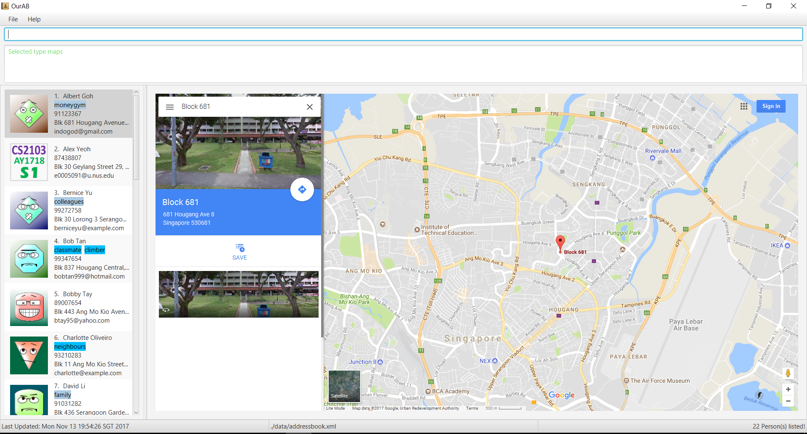

= OurAB - Manual Testing Script
:experimental:

=== `Setting Up`

** Download OurAB.jar and place it in a clean folder. Double click on the .jar file to start the OurAB application.
   Sample data will be generated automatically.

=== `UI features`

==== [.underline]#Splash Screen#

** Expected behaviour:
*** When the address book is loading, a splash screen should appear.

image::image25.png[]

==== [.underline]#Command Box Helper#

** Type without pressing enter: kbd:[a]
** Expected Behaviour:
*** All commands starting with `a` are displayed in the command box helper.

image::image23.png[]

** Press the kbd:[&darr;] key, followed by the kbd:[TAB] key.
** Expected Behaviour:
*** Display should show:

image::image17.png[]

==== [.underline]#Settings Selector#

** Type without pressing enter: `pref` or `choose`
** Expected Behaviour:
*** Settings selector should pop up at the side:

image::image2.png[]

** Press the kbd:[&larr;Backspace] key
** Command line should now contain: `pre` or `choos`
** Expected Behaviour:
*** Settings selector should slide out of screen.

==== [.underline]#Changing user preferences#

*Use `pref` command to view or change preferences*

** *View the current path of OurAB data*
*** Type and press enter: `pref abpath`
*** Expected output:
+
----
data/addressbook.xml
----

** *Change the theme of the OurAB*
*** Type and press enter: `pref theme dark`
*** Expected output:
+
----
Edited preference: Theme
from Light
to Dark
----
+
*** Expected behaviour: The colour theme of the address book changes into a "dark" theme.

*** Type and press enter: `pref theme light`
*** Expected output:
+
----
Edited preference: Theme
from Dark
to Light
----
+
*** Expected behaviour: The colour theme of the address book changes back into a "light" theme.

*** Type and press enter: `pref theme rainbow`
*** Expected output:
+
----
Invalid value rainbow for preference key Theme
----
+
*** Type and press enter: `pref CAP 5.0`
*** Expected output:
+
----
Invalid preference key: CAP
----

=== `Address list features`

==== [.underline]#Profile Picture#

*Add a new user with existing Gravatar*

** Type and press enter: `add n/Jon Smith p/12341234 e/e0005091@u.nus.edu a/10 Kent Ridge Crescent, 119260 t/friends`
** Expected behaviour: A new person is added and the profile picture of that person is the CS2103 logo. Note that the person is added to the bottom of the list.
+
image::image26.png[]

*Add a new user without existing Gravatar*

** Type and press enter: `add n/Liu Hang p/12344321 e/liuhang@u.nus.edu a/25 Prince George's Park, 118420 t/friends`
** Expected behaviour: A new person is added and the profile picture of that person is the default silhouette photo. Note that the person is added to the bottom of the list.
+
image::image9.png[]

*Edit user Email Address*

** Type and press enter: `edit 1 e/e0005091@u.nus.edu`
** Expected behaviour: Person #1 should have the CS2103 profile photo
+
image::image29.png[]

*Change the style of default profile photos*

** Type and press enter: `pref dp face`
** Wait about 3 to 5 seconds for the application to download images
** Type and press enter: `list`
** Expected behaviour: Persons with default silhouette photos previously should now have cartoon faces as default profile photos instead. Not all photos might be updated depending on the network condition.
+
image::image30.png[]

==== [.underline]#Add command#

** Type and press enter: `add n/John Smith p/12341234 e/jsmith@gmail.com a/10 Kent Ridge Crescent, 119260 t/friends`
** Expected output:
+
----
New person added: John Smith Phone: 12341234 Email: jsmith@gmail.com Address: 10 Kent Ridge Crescent, 119260 Tags: [friends]
----

** Expected behaviour: A new person named 'John Smith' is added to the end of the address book
+
image::image31.png[]

==== [.underline]#Edit command#

** Type and press enter: `edit 21 p/43214321 e/johns@gmail.com`
** Expected output:
+
----
Edited Person: Stanley Tay Phone: 43214321 Email: johns@gmail.com Address: Blk 443 Ang Mo Kio Avenue 10, #12-05 Tags: [colleagues][friends]
----
** Expected behaviour: The phone number and email address for Stanley Tay is updated:
+
image::image32.png[]

==== [.underline]#List command#

** Type and press enter: `list`
** Expected output:
+
----
Listed all persons in alphabetical order
----
** Expected behaviour: All persons in the address book are listed in alphabetical order.
+
image::image33.png[]

==== [.underline]#List By Most Searched command#
*Sorts by Search frequency*

** Type and press enter: `search bernice`
** Expected output:
+
----
1 persons listed!
----
** Expected behaviour: Bernice Yu is listed.
+
image::image11.png[]

** Type and press enter: `listMostSearched`
** Expected output:
+
----
Listed all persons sorted by frequency of search
----
** Expected behaviour: Bernice Yu should be the first person listed.
+
image::image34.png[]

==== [.underline]#Search command#
*Search by Name*

** Type and press enter: `search Alex`
** Expected output:
+
----
1 persons listed!
----
** Expected behaviour: Returns all contacts with the name "Alex"
+
image::image12.png[]

*Search by Address*

** Type and press enter: `search Serangoon`
** Expected output:
+
----
2 persons listed!
----
** Expected behaviour: Returns all contacts with the address "Serangoon"
+
image::image3.png[]

*Search by Telephone Number*

** Type and press enter: `search 99347654`
** Expected output:
+
----
1 persons listed!
----
** Expected behaviour: Returns all contacts with the number "9934754"
+
image::image7.png[]

*Search by Email Address*

** Type and press enter: `search berniceyu@example.com`
** Expected output:
+
----
1 persons listed!
----
** Expected behaviour: Returns all contacts with the email "berniceyu@example.com"
+
image::image11.png[]

*Parameter does not exist*

** Type and press enter: `search a`
** Expected output:
+
----
0 persons listed!
----
** Expected behaviour: Return no contacts.

==== [.underline]#Delete command#

** Type and press enter: `list`
** Type and press enter: `delete 23`
** Expected output:
+
----
Deleted Person: Yong Kong Kang Phone: 98664345 Email: kongkang@mail.com Address: Blk 127 HDB Toa Payoh, #10-10 Tags: [friends]
----
** Expected behaviour: The person Yong Kong Kang is deleted from the address book.

==== [.underline]#Delete Tag command#

** Type and press enter: `deleteTag hello`
** Expected output:
+
----
Tag(s) not in address book; Nothing to delete
----

** Type and press enter: deleteTag friends
** Expected output:
+
----
Tag(s) successfully deleted
----

=== `Display Window functionalities`

==== [.underline]#Choose command#
** Type and press enter: `select 1`
** Expected output:
+
----
Selected Person: 1
----
** Type and press enter: `choose linkedin`
** Expected output:
+
----
Selected type linkedin
----
** Log into your linkedin account.
** Expected behaviour: Albert Goh search is displayed in the main display window.
+
image::image36.png[]

** Type and press enter: `select 68`
** Expected output:
+
----
The person index provided is invalid
----

** Type and press enter: `choose google`
** Expected output:
+
----
Selected type google
----
** Expected behaviour: Google search for Albert Goh is displayed in the main display window.
+
image::image37.png[]

** Type and press enter: `choose maps`
** Expected output:
+
----
Selected type maps
----
** Expected behaviour: Google Maps display for Albert Goh's address is displayed in the main display window.
+
image::image39.png[]

** Type and press enter: `choose meeting`
** Expected output:
+
----
Selected type meeting
----
** Expected behaviour: Meeting list is displayed in the main display window.
+
image::image40.png[]

** Type and press enter: `choose #(*%`
** Expected output:
+
----
Invalid arguments provided.
choose : selects the type of display in the main browser window.
Parameters: <TYPE>
Example: choose linkedin
----

** Type and press enter: `choose linkednotin`
** Expected output:
+
----
The display type provided is invalid
----

==== [.underline]#Map command#

** Type and press enter: `select 1`
** Expected output:
+
----
Selected Person: 1
----
** Expected behaviour: Return the address of Albert Goh (index 1) in google maps in the browser panel
+

** Type and press enter: `map 20`
** Expected output:
+
----
Map Display Successful! Address of: Samuel Ong Phone: 94326172 Email: xxxONSENxxx@hotmail.com Address: 820 Thompson Rd, #03-03 Tags: [colleagues]
----
** Expected behaviour: Return the address of Samuel Ong (index 20) in google maps in the browser panel
+
image::image27.png[]

** Type and press enter: `map 66`
** Expected output:
+
----
The person index provided in invalid
----
** Expected behaviour: Returns an error as index is out of bounds.

==== [.underline]#Asana Configuration#

[NOTE]
For optimal performance, please set Chrome as your default browser.

*Setting Up*

** Type and press enter: `setupAsana`
** Expected output:
+
----
1. Login & allow OurAB to access your Asana account
2. Copy from the site, the code: DIGIT/ALPHANUMERICS
Example: 0/123a689ny8912h324h78s
3. Type: setKey 0/ALPHANUMERICS
----
** Expected behaviour: A new browser window will be opened with Asana login page opened.

** Login to Asana.
+
----
Email Address : f09b4.ourab@gmail.com
Password : f09b4ourab
----

[NOTE]
You may login to your own account as well. The access token will be
destroyed as soon as you close OurAB application.

image::image15.png[]

** Click on `Allow`
** Copy the code from the redirect page
+
image::image28.png[]

** Type and press enter: `setKey [paste code here]`
** Expected output:
+
----
Asana setup successful!
----

[NOTE]
If the message Please try again with a valid code from Asana is seen after pasting the right code, the access code has probably expired. Start from step 1 again.

*Test with inaccurate access keys*

** Type and press enter: `setKey 123`
** Expected output:
+
----
Please make sure the access code you have copied follows the format:
DIGIT/ALPHANUMERICS
----

** Type and press enter: setKey 0/12345e6789
** Expected output:
+
----
Please try again with a valid code from Asana
----

==== [.underline]#Add Meeting command#

[NOTE]
Since multiple groups might be testing and using this Asana account at the same time, please think of an agenda for your meeting which you will be able to identify later.

** Switch off your connection to the internet.
** Type and press enter: `addMeeting on 21/12/2017 from 1000 at NUS Computing about life with 4`
** Expected output:
+
----
New meeting added locally!
Connect to the internet to post a meeting on Asana.
----

** Connect to the internet.
** Type and press enter: `addMeeting on 22/12/2017 from 1400 at NUS Computing about gambling with 2`
** Expected output:
+
----
New meeting added locally and to Asana!
----
** Expected behaviour: Open Asana web/mobile app and login to see your meeting added to Asana.
+
image::image22.png[]

** Type and press enter: `choose meeting`
** Expected output:
+
----
Selected type meeting
----
** Expected behaviour: New meeting added should be in the meeting display window.
+
image::image21.png[]

** Type and press enter: `addMeeting on 22/12/2017 from 1400 at NUS Computing about CS2103 Project Meeting with 2`
** Expected output:
+
----
This meeting already exists in the address book
----

** Type and press enter: `addMeeting on 3/12/201 from 1400 at NUS Computing about doodling with 2`
** Expected output:
+
----
Please enter a date & time in the format dd/mm/yyyy & hhmm respectively!
----

** Type and press enter: `addMeeting on 20/10/1995 from 1400 at NUS Computing about peeing with 2`
** Expected output:
+
----
Please enter a date & time that is in the future.
----

==== [.underline]#Next Meeting command#
*To view the next upcoming meeting*

** Type and press enter: `nextMeeting`
** Expected output:
+
----
Upcoming meeting with Alex Yeoh, Bernice Yu, Charlotte Oliveiro
Date: 2018/01/01  Time: 00:00:00
Location: Home
Notes: New Year Celebration
----

=== `Other functionalities`

==== [.underline]#Help command#
** Type and press enter: `help`
** Expected output:
+
----
Opened help window.
----
** Expected behaviour: The help window will be opened.
+
image::image5.png[]

** Close the window and press the kbd:[F1] key.
** Expected behaviour: The same help window is opened.

==== [.underline]#History command#
** Type and press enter: `history`
** Expected output:
+
----
Entered commands (from most recent to earliest):
help
nextMeeting
addMeeting on 20/10/1995 from 1400 at NUS Computing about <something> with 2
addMeeting on 3/12/201 from 1400 at NUS Computing about <something> with 2
----

==== [.underline]#Undo command#
** Type and press enter: `delete 21`
** Type and press enter: `undo`
** Expected output:
+
----
Undo success!
----
** Expected behaviour: John Smith is back in the address book with updated phone number and email address.
+
image::image35.png[]

==== [.underline]#Redo command#
** Type and press enter: `redo`
** Expected output:
+
----
Data has been cleared!
----
** Expected behaviour: All persons and meetings in OurAB are deleted.
+
image::image24.png[]

** Type and press enter: `undo`
** Expected output:
+
----
Undo success!
----
** Expected behaviour: Both address book and meeting data are restored.

==== [.underline]#Exit command#
** Type and press enter: `exit`
** Expected behaviour: OurAB application exits.
